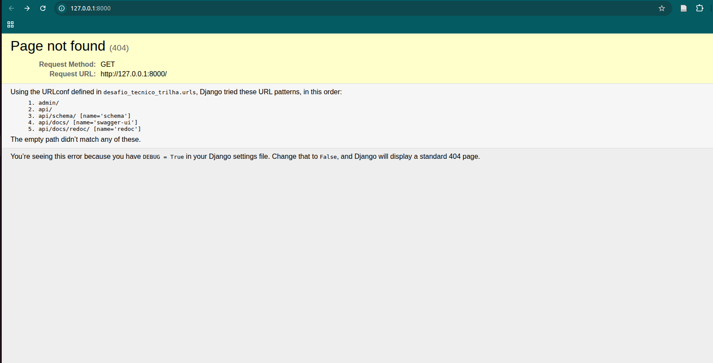
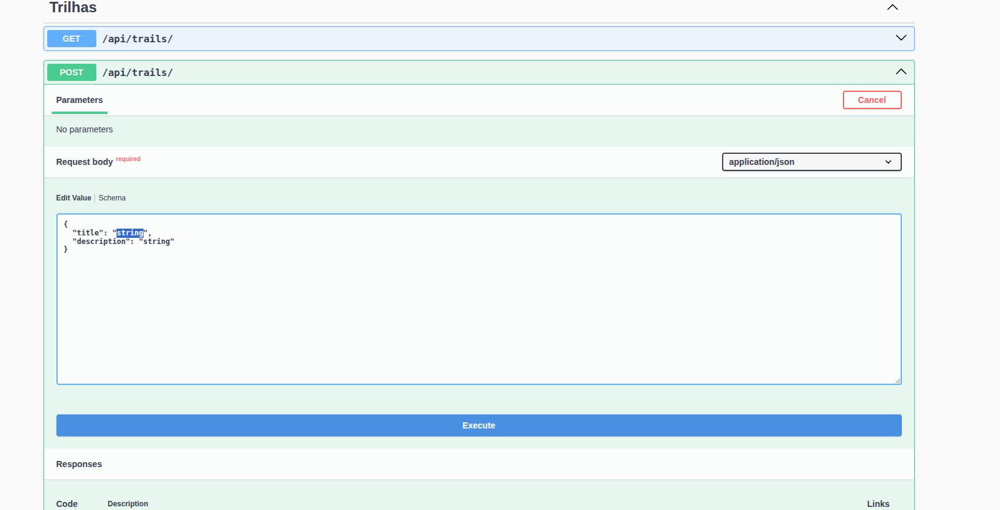
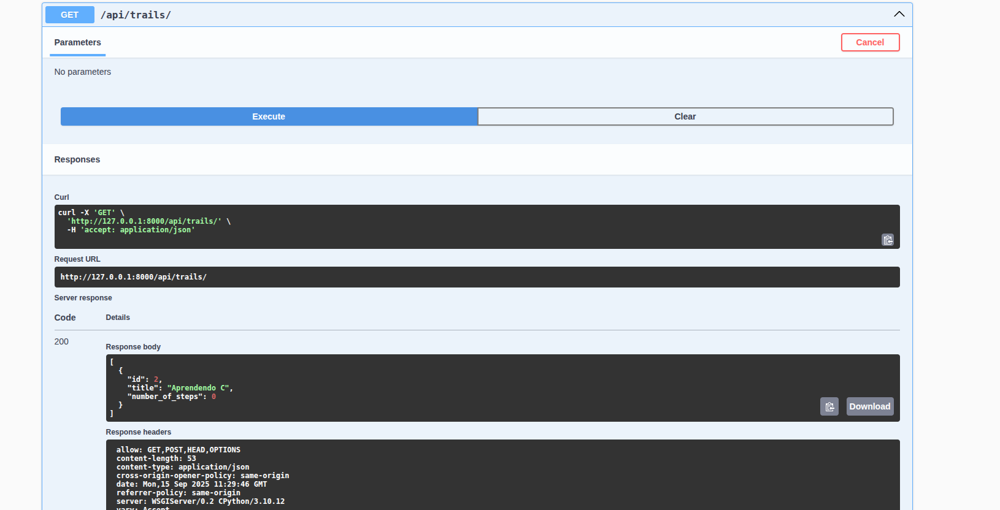
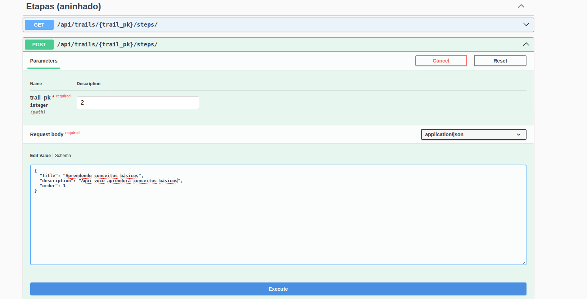
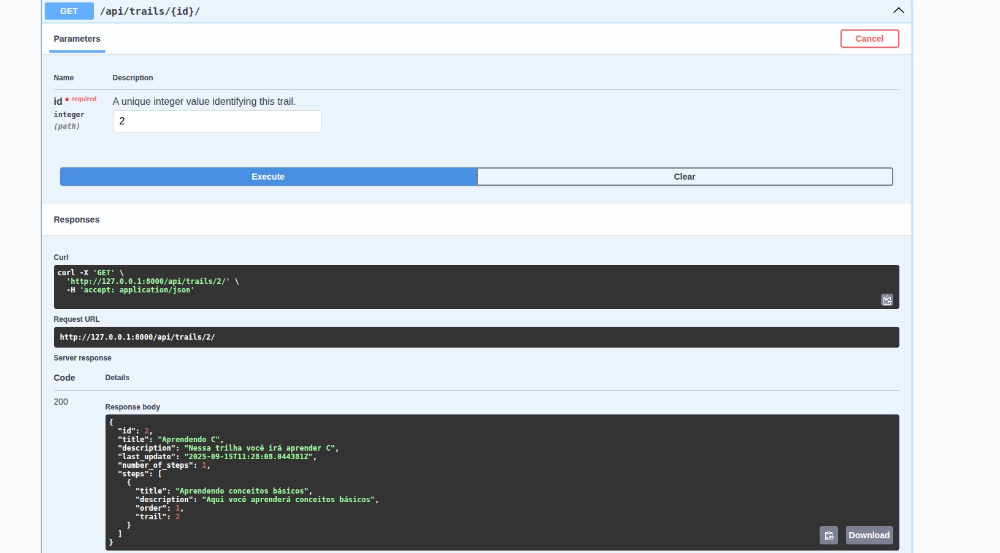
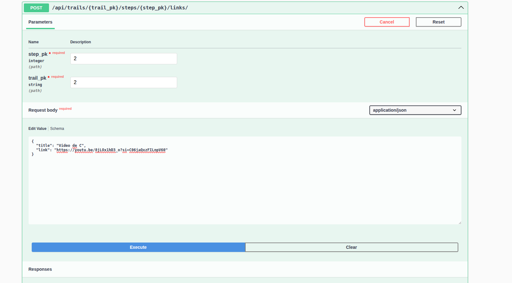

# Sistema de Trilhas de Treinamento - API

Esta é uma API RESTful desenvolvida com Django e Django REST Framework para gerenciar um sistema de trilhas de treinamento. A plataforma permite a criação de trilhas de aprendizado, compostas por etapas sequenciais, e o gerenciamento do progresso dos clientes matriculados.

## Funcionalidades Principais

* **Gerenciamento de Trilhas:** Criação, listagem, atualização e exclusão de trilhas de treinamento.
* **Etapas Sequenciais:** Cada trilha pode conter múltiplas etapas com uma ordem definida, que deve ser única por trilha.
* **Anexos por Etapa:** Cada etapa pode conter múltiplos links como material de apoio.
* **Matrícula de Clientes:** API com endpoint específico para matricular um ou mais clientes em uma trilha.
* **Rastreamento de Progresso Automático:**
  * Ao matricular um cliente em uma trilha, o sistema cria automaticamente registros de progresso para cada etapa daquela trilha.
* **Contadores Automáticos:**
  * O número de etapas em uma trilha é atualizado automaticamente sempre que uma etapa é adicionada ou removida.
* **Documentação de API Interativa:** A API é totalmente documentada com Swagger (OpenAPI), permitindo a visualização e teste de todos os endpoints diretamente pelo navegador.

## 🚀 Tecnologias Utilizadas

* **Backend:** Python 3.10+
* **Framework:** Django
* **API:** Django REST Framework
* **Roteamento Aninhado:** `drf-nested-routers`
* **Documentação da API:** `drf-spectacular` (para Swagger/OpenAPI)
* **Gerenciamento de Dependências:** `pipenv`
* **Banco de Dados:** SQLite (para desenvolvimento)

## 🔧 Configuração e Instalação

Siga os passos abaixo para configurar o ambiente de desenvolvimento.

1.  **Clone o repositório:**
    ```bash
    git clone https://github.com/SEU_USUARIO/seu-projeto.git
    cd seu-projeto
    ```

2.  **Criar e ativar o ambiente virtual:**
    Para criar o ambiente virtual e ativá-lo utilize os seguintes comandos em sequência
    ```bash
     python -m venv venv #Linux/Mac/Windows
     source venv/bin/activate #Linux/Mac

     .\venv\Scripts\activate #Windows
    ```

3.  **Instalar as dependências:**
    ```bash
    pip install -r requirements.txt
    ```

4.  **Crie as migrações do banco de dados:**
    ```bash
    python manage.py makemigrate
    ```

5.  **Aplique as migrações do banco de dados:**
    ```bash
    python manage.py migrate
    ```
6.  **Inicie o servidor de desenvolvimento:**
    ```bash
    python manage.py runserver
    ```
**Tela Esperada**


7.  **Para acessar a API documentada cole na URL**
    ```bash
    http://127.0.0.1:8000/api/docs/#/
    ```

O servidor estará rodando em `http://127.0.0.1:8000/`.

## 📚 Documentação da API

A documentação completa e interativa da API, gerada com Swagger UI, está disponível no seguinte endpoint após iniciar o servidor:

* **`http://127.0.0.1:8000/api/docs/`**

## 🌐 Estrutura dos Endpoints da API

A API utiliza roteadores aninhados para refletir a hierarquia dos dados.


| Método                      | Endpoint                                                      | Descrição                                                   |
| :-------------------------- | :------------------------------------------------------------ | :---------------------------------------------------------- |
| `GET`, `POST`               | `/api/trails/`                                                | Lista todas as trilhas ou cria uma nova trilha.             |
| `GET`, `PUT`, `PATCH`       | `/api/trails/{trail_pk}/`                                     | Detalhes de uma trilha específica.                          |
| `POST`                      | `/api/trails/{trail_pk}/add-client/`                          | Matricula um ou mais clientes em uma trilha.                |
| `GET`, `POST`               | `/api/trails/{trail_pk}/steps/`                               | Lista ou cria etapas **para uma trilha específica**.          |
| `GET`, `PUT`, `PATCH`       | `/api/trails/{trail_pk}/steps/{step_pk}/`                     | Detalhes de uma etapa específica.                           |
| `GET`, `POST`               | `/api/trails/{trail_pk}/steps/{step_pk}/links/`               | Lista ou cria links para uma etapa específica.              |
| `GET`, `POST`               | `/api/trails/{trail_pk}/steps/{step_pk}/attachments/`         | Lista ou cria anexos para uma etapa específica.             |

### Acesso Global (Não Aninhado)

| Método                      | Endpoint                                                      | Descrição                                                   |
| :-------------------------- | :------------------------------------------------------------ | :---------------------------------------------------------- |
| `GET`                       | `/api/all-steps/`                                             | Lista **todas** as etapas de **todas** as trilhas.           |
| `GET`                       | `/api/all-steps/{step_pk}/`                                   | Detalhes de uma etapa específica (acesso global).           |
| `GET`, `POST`               | `/api/all-steps/{step_pk}/links/`                             | Lista ou cria links para uma etapa (acesso global).         |
| `GET`, `POST`               | `/api/all-steps/{step_pk}/attachments/`                       | Lista ou cria anexos para uma etapa (acesso global).        |
| `GET`                       | `/api/all-links/`                                             | Lista **todos** os links de **todas** as etapas.             |

### Clientes e Progresso

| Método                      | Endpoint                                                      | Descrição                                                   |
| :-------------------------- | :------------------------------------------------------------ | :---------------------------------------------------------- |
| `GET`, `POST`               | `/api/clients/`                                               | Lista todos os clientes ou cria um novo cliente.            |
| `GET`                       | `/api/clients/{client_pk}/`                                   | Detalhes de um cliente específico.                          |
| `GET`, `POST`               | `/api/clients/{client_pk}/client-progress/`                   | Lista ou inicia o progresso de um cliente em uma trilha.    |

## 🤖 Funcionalidades Automáticas (Signals)

O projeto faz uso extensivo do sistema de Sinais do Django para automatizar a lógica de negócio:
* **`post_save` em `Step`**: Atualiza o contador `number_of_step` na `Trail` correspondente.
* **`post_delete` em `Step`**: Decrementa o contador `number_of_step` na `Trail`.
* **`post_save` em `ClientProgress`**: Verifica se uma etapa foi concluída, caso tenha sido, ele atribui automaticamente o cliente a uma nova etapa.

## Exemplo de Funcionamento

**Criando uma Trilha:**


**Imprimindo Trilhas Cadastradas:**


**Adicionando Etapas a Trilha:**


**Imprimindo Trilha e Suas Etapas:**


**Adicionando Link na Etapa:**



